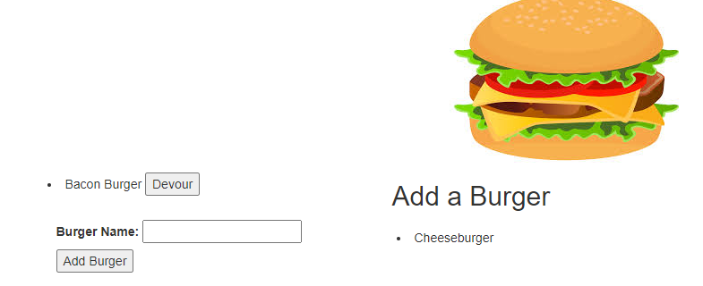

# Eat-da-Burger

## Description 
This is homework 13, a program to demonstrate the MVC model.

## Table of Contents 
[Installation](#installation)

[Usage](#usage)

[License](#license)

[Contributing](#contributing)

[Tests](#tests)

[Questions](#questions)
## Installation
Download the source code, then in the folder with index.js run "npm install".

## Usage
Navigate to https://secret-oasis-54163.herokuapp.com/. Use to form to add new burgers, and the devour buttons to mark them as devoured.

## License
This is licensed under the [MIT license](https://choosealicense.com/licenses/mit/).

## Contributing
Feel free to contribute

## Tests
No tests at the moment

## Questions
GitHub: https://github.com/tober65
Email: timothy.ober@gmail.com